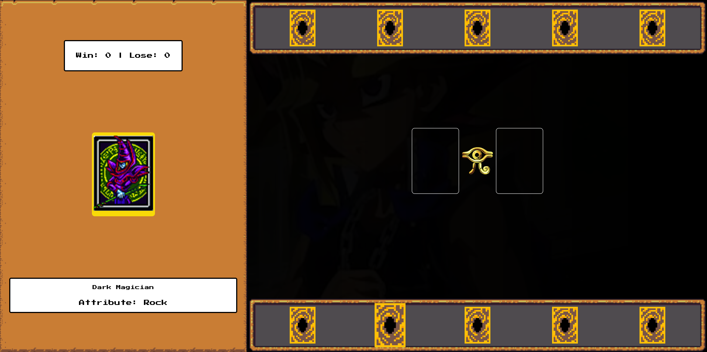
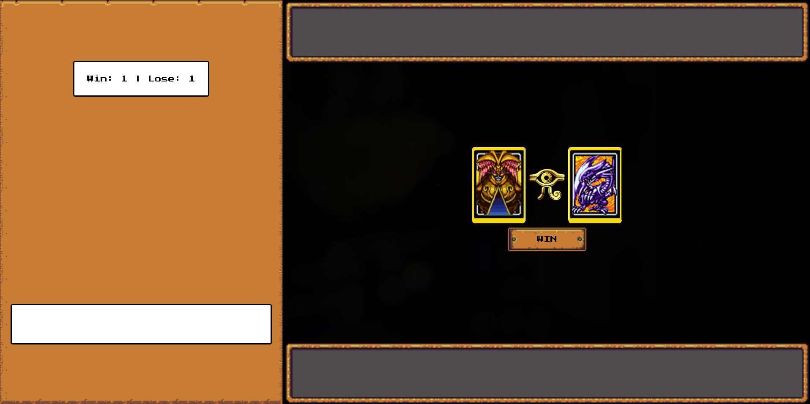

# jogo estilo Jokenpô em JS com visual -- Yu-Gi-Oh --

Este repositório contém um conjunto de recursos visuais e estruturais relacionados ao universo Yu-Gi-Oh. Ele utiliza HTML, CSS e JavaScript, oferecendo uma base sólida para quem deseja criar experiências dinâmicas, como jogos de cartas.

O projeto foi desenvolvido como parte do aprendizado oferecido pela [DIO](https://web.digitalinnovation.one/), incentivando boas práticas de organização de código e manipulação do DOM.

## Funcionalidades

- **Imagens de Cartas**: Inclui recursos visuais para personalização e uso em jogos.
- **Estrutura Base**: Fornece templates em HTML e CSS para construção de layouts relacionados ao tema Yu-Gi-Oh.
- **Flexibilidade**: Pode ser utilizado como ponto de partida para diversos projetos criativos.

## Tecnologias Utilizadas

- **HTML**: Estrutura base para organização dos elementos visuais.
- **CSS**: Estilização para dar vida aos elementos visuais.
- **JavaScript**: Manipulação dinâmica e implementação de interatividade.

## Demonstração




## Estrutura do Projeto

```markdown
.
├── src
│   └──  assets
│   	 ├── assets            
│  	 │   ├── audios   		     # sons do jogo
│  	 │   ├── cursor     		     # cursores para o jogo
│  	 │   ├── favicon      		     # icone para o título da página
│ 	 │   ├── icons         		     # Ícones para a estilização do jogo
│  	 │   ├── rpg    	             # Imagens para a customização da página
│  	 │   └── video        		     # video de fundo do jogo
│   	 ├── scripts           
│ 	 │   └── engine.js  		     # Lógica e manipulação dos recursos
│  	 └── styles           		     
│  	     ├── buttons.css 		     # estilo de botões
│  	     ├── containers_and_frames.css   # estilos de container e frames
│  	     ├── main.css     		     # Estilo principal do projeto
│ 	     └── reset.css     		     # reset de estilo
│
├── img1.png               # imagem exemplo 1

├── img2.png               # imagem exemplo 2

├── index.html             # Página de exemplo utilizando os recursos

└── README.md             # Documentação do projeto
